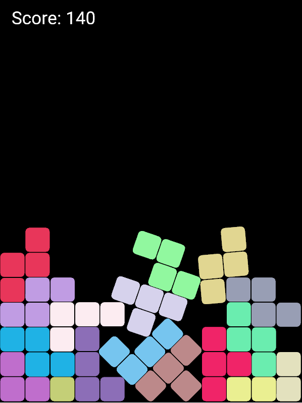

Frustration Tetris
==================

A tetris clone with a twist.

Written in Rust, using [glium](http://github.com/tomaka/glium) and [nphysics](https://github.com/sebcrozet/nphysics)

### Polyominos of different sizes
It's possible to use polyominos of any size instead of tetrominos by generating code using the Python program `tools/polyominoes.py`.

For example, to compile the game for pentominos (5 blocks / polyomino):
1. Run `./tools/polyominoes.py 5 pentominos`
2. Copy the output of this command into the module `polyominos` in `src/consts.rs`
3. Fill in a value for the linear and angular forces in the generated code (marked by `TODO`)
4. Add the relevant feature (`pentominos = []`) in `Cargo.toml`
5. Recompile and run the game with this feature activated: `cargo run --release --no-default-features --features="pentominos"`
